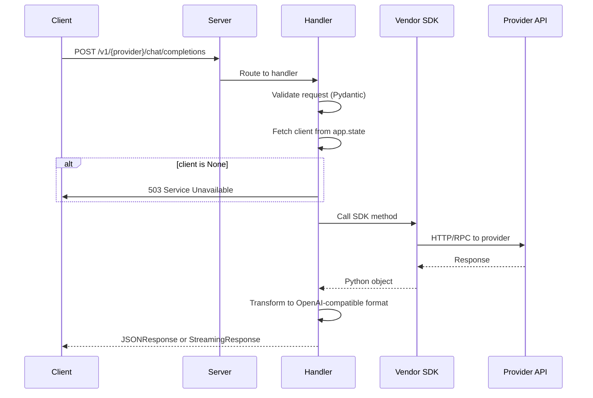

# Architecture

## Overview

This project is a **unified OpenAI-compatible API gateway** that proxies requests to 5 different AI providers:

| Provider | SDK Type | Async/Sync | Auth Method |
|---|---|---|---|
| DeepSeek | Vendored (`sys.path`) | Sync → ThreadPoolExecutor | Cookie |
| Gemini | Vendored (`sys.path`) | Async | Cookie |
| NotebookLM | PyPI (`notebooklm-py`) | Async | Storage file |
| Meta AI | Vendored (`sys.path`) | Sync → ThreadPoolExecutor | Cookie |
| Grok | PyPI (`GrokWeb-to-API`) | Sync → ThreadPoolExecutor | Cookie |

All providers expose two OpenAI-compatible endpoints (`/models`, `/chat/completions`) plus provider-specific endpoints under `/v1/{provider}/...`.

---

## Project Structure

```
unofficial-api/
├── app/
│   ├── __init__.py
│   ├── server.py              # FastAPI app, lifespan, router registration
│   ├── schemas.py             # Shared Pydantic models (OpenAI-compatible + provider-specific)
│   └── routers/
│       ├── __init__.py
│       ├── deepseek/           # 2 routes (models, chat/completions)
│       │   ├── __init__.py
│       │   ├── router.py       # APIRouter instance, imported by server
│       │   └── routes.py       # Endpoint handlers
│       ├── gemini/             # 12 routes
│       │   ├── __init__.py
│       │   ├── router.py
│       │   ├── chat.py         # Chat completions + streaming
│       │   ├── models.py       # Model list
│       │   ├── history.py      # Chat history CRUD
│       │   ├── gems.py         # Gems (custom GPTs) CRUD
│       │   ├── research.py     # Deep research start/poll
│       │   └── helpers.py      # Shared utils, response builders
│       ├── grok/               # 2 routes
│       │   ├── __init__.py
│       │   ├── router.py
│       │   ├── chat.py         # Chat completions (fake streaming)
│       │   ├── models.py
│       │   └── helpers.py
│       ├── metaai/             # 4 routes
│       │   ├── __init__.py
│       │   ├── router.py
│       │   ├── chat.py         # Chat completions
│       │   ├── models.py
│       │   ├── generation.py   # Image + Video generation
│       │   └── helpers.py
│       └── notebooklm/         # ~84 routes
│           ├── __init__.py
│           ├── router.py
│           ├── helpers.py       # Client fetch, artifact/status response builders
│           ├── models.py        # Model list
│           ├── notebooks.py     # Notebook CRUD
│           ├── sources.py       # Source CRUD + management (14 routes)
│           ├── notes.py         # Note CRUD (5 routes)
│           ├── chat.py          # Chat completions + conversation management (7 routes)
│           ├── artifacts.py     # Artifact generation + download (32 routes)
│           ├── research.py      # Research start/poll/wait/import (5 routes)
│           ├── sharing.py       # Sharing management (6 routes)
│           ├── settings.py      # Account settings (4 routes)
│           └── mind_maps.py     # Mind map CRUD + tree (6 routes)
├── deepseek-api/         # Vendored SDK (git submodule)
├── Gemini-API/           # Vendored SDK (git submodule)
├── notebooklm-py/        # Vendored SDK (git submodule)
├── metaai-api/           # Vendored SDK (git submodule)
├── GrokWeb-to-API/       # Vendored SDK (git submodule)
├── docs/
│   ├── ARCHITECTURE.md
│   ├── CONVERSION.md
│   ├── deepseek.md
│   ├── gemini.md
│   ├── grok.md
│   ├── metaai.md
│   ├── notebooklm.md
│   └── notebooklm-artifacts.md
├── Dockerfile
├── docker-compose.yml
├── pyproject.toml
├── .env.example
├── README.md
└── run.sh
```

### Router Pattern

Each provider follows the same convention:

1. **`router.py`** — Creates and exports a single `APIRouter()` instance
2. **`__init__.py`** — Imports the router and all handler modules (so endpoints register via `@router.get/post/...` decorators)
3. **Handler files** — Each file imports `from .router import router` and decorates functions

NotebookLM uses a flat file-per-feature approach (13 files). Other providers use fewer files since they have fewer routes.

---

## Lifecycle (`app/server.py`)

### Startup (`lifespan` context manager)

On every server start:
1. Loads `.env` via `dotenv`
2. Inserts vendored SDKs into `sys.path`
3. Creates and initializes each provider's client:
   - **Gemini**: `GeminiClient(secure_1psid=..., secure_1psidts=...)` → `await client.init()`
   - **NotebookLM**: `NotebookLMClient.from_storage(path=...)` → `await ctx.__aenter__()`
   - **Meta AI**: `MetaAI(cookies={...})` — synchronous
   - **Grok**: `GrokClient(cookies={...})` — synchronous
   - **DeepSeek**: initialized lazily per-request (stateless)
4. Stores all clients on `app.state`

If a client fails to initialize (missing credentials, network error), it logs a warning and sets the client to `None`. Subsequent requests return 503.

### Shutdown

- Gemini: `await client.close()`
- NotebookLM: `await ctx.__aexit__()`
- Meta AI, Grok, DeepSeek: no explicit cleanup needed (sync clients)

### Per-Request Flow



---

## Client Architecture

### Sync Clients (DeepSeek, Meta AI, Grok)

These SDKs use `requests` (synchronous). Since FastAPI is async, we wrap calls in `asyncio.get_event_loop().run_in_executor()` with a `ThreadPoolExecutor`.

```python
# Pattern used in handlers:
loop = asyncio.get_event_loop()
result = await loop.run_in_executor(None, lambda: sync_client.method(**params))
```

### Async Clients (Gemini, NotebookLM)

These SDKs use `aiohttp` / native `asyncio`. Handlers `await` them directly.

```python
# Geminin
result = await client.chat.send_message(...)
# NotebookLM
result = await client.chat.ask(notebook_id=..., question=...)
```

---

## Streaming

| Provider | Type | Implementation |
|---|---|---|
| Gemini | Real SSE | `async for chunk in response: yield chunk` |
| DeepSeek | Real SSE | Stream via WebSocket → SSE translation |
| Meta AI | Real SSE | `response.iter_content(chunk_size=...)` |
| Grok | Fake | Receive full response, split by space, yield each word as SSE event |
| NotebookLM | Fake | Receive full answer, split by `\n`, yield each line as SSE event |

All providers normalize to the same SSE format:
```
data: {"choices": [{"delta": {"content": "..."}}]}

data: [DONE]
```

---

## Authentication

Each provider requires cookies extracted from a browser session.

| Provider | Env Vars | Extraction Method |
|---|---|---|
| DeepSeek | `DEEPSEEK_SESSION_ID`, `DEEPSEEK_AUTH_TOKEN` | Browser DevTools → Cookies |
| Gemini | `GEMINI_SECURE_1PSID`, `GEMINI_SECURE_1PSIDTS` (optional) | Browser DevTools → Cookies |
| NotebookLM | `NOTEBOOKLM_STORAGE_PATH` | CLI: `notebooklm login` → `storage_state.json` |
| Meta AI | `META_AI_DATR`, `META_AI_ECTO_1_SESS` (optional), `META_AI_ABRA_SESS` (optional) | Browser DevTools → Cookies |
| Grok | `GROK_SSO`, `GROK_SSO_RW` | Browser DevTools → Cookies |

Cookies expire. When requests start returning auth errors, re-extract and restart the server.

---

## Vendor SDKs

Five vendored SDK directories exist at the project root. They are standalone git repos (not submodules).

### `sys.path` inclusion (no pip needed)

These SDKs are plain Python packages usable via `sys.path.insert`:

```python
# app/server.py
sys.path.insert(0, os.path.join(BASE, "..", "Gemini-API/src"))
sys.path.insert(0, os.path.join(BASE, "..", "metaai-api/src"))

from gemini_webapi import GeminiClient       # from Gemini-API/src/gemini_webapi/
from metaai_api import MetaAI                # from metaai-api/src/metaai_api/
```

DeepSeek uses:
```python
sys.path.insert(0, os.path.join(BASE, "..", "deepseek-api"))
from deepseek_api import DeepseekClient
```

### pip install required

**GrokWeb-to-API** requires `pip install` because `grok_client/__init__.py` calls `importlib.metadata.version("GrokWeb-to-API")` which fails without a proper package installation. Installed via:

```bash
uv add ./GrokWeb-to-API
```

**NotebookLM** is installed from PyPI:
```bash
pip install notebooklm-py>=0.7.2
```

### Dockerfile strategy

```dockerfile
COPY deepseek-api/ deepseek-api/
COPY Gemini-API/ Gemini-API/
COPY metaai-api/ metaai-api/
COPY GrokWeb-to-API/ GrokWeb-to-API/

# notebooklm-py is pip-installed from PyPI (not vendored)
RUN pip install notebooklm-py
# Grok needs pip install for importlib.metadata
RUN pip install -e ./GrokWeb-to-API
```

---

## Error Handling

- **Missing client** (not initialized/credentials missing) → `503 {"error": "Provider not initialized"}`
- **SDK errors** → caught in `try/except Exception`, returned as `500 {"error": str(e)}`
- **Validation errors** → FastAPI/Pydantic auto-422 with field details
- **Provider auth errors** → bubble up from SDK as `Exception` messages (e.g., "Session expired")

Common error response format:
```json
{"error": "Descriptive error message"}
```

---

## OpenAPI / Swagger

All endpoints and models are auto-documented via FastAPI's OpenAPI integration. Each endpoint uses `summary=...` and Pydantic models with `Field(description=..., examples=...)`.

- Swagger UI: `http://localhost:8000/docs`
- ReDoc: `http://localhost:8000/redoc`
- OpenAPI JSON: `http://localhost:8000/openapi.json`

---

## Docker

Multi-platform image supporting `linux/amd64` and `linux/arm64`:

```bash
docker buildx build --platform linux/amd64,linux/arm64 \
  -t 2noscript/unofficial-api:latest --push .
```

`docker-compose.yml` mounts `.env` for credentials and sets `NOTEBOOKLM_STORAGE_PATH` to a host-mounted volume.
