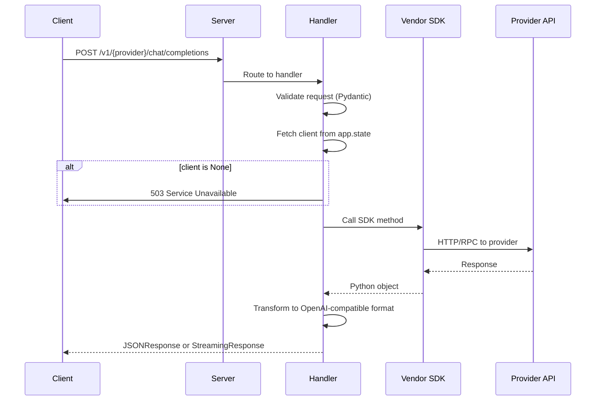

# Architecture

## Overview

This project is a **unified OpenAI-compatible API gateway** with dynamic multi-profile load balancing, proxying requests to DeepSeek and Gemini:

| Provider | SDK Type | Async/Sync | Auth Method |
|---|---|---|---|
| DeepSeek | Vendored (`sys.path`) | Sync → ThreadPoolExecutor | Profile Token |
| Gemini | Vendored (`sys.path`) | Async | Profile Cookie |

Both providers expose two OpenAI-compatible endpoints (`/models`, `/chat/completions`) plus profile management endpoints (`/v1/profiles`).

---

## Project Structure

```
unofficial-api/
├── core/
│   ├── server.py              # FastAPI app, lifespan, router registration
│   ├── profile.py             # Profile storage (profiles.json) & CRUD
│   ├── load_balancer.py       # Multi-profile Round-Robin load balancer & session affinity
│   ├── gemini_pool.py         # Async connection pool for Gemini clients
│   ├── schemas.py             # Shared Pydantic models
│   └── routers/
│       ├── deepseek/           # DeepSeek routes (models, chat/completions)
│       ├── gemini/             # Gemini routes (models, chat/completions)
│       ├── profiles/           # Profile management CRUD routes
│       └── keys/               # API key management routes
├── deepseek-api/         # Vendored SDK (git submodule)
├── Gemini-API/           # Vendored SDK (git submodule)
├── data/                 # Data directory (profiles.json, api_keys.json, sessions.json)
├── docs/
│   ├── ARCHITECTURE.md
│   ├── CONVERSION.md
│   ├── auth.md
│   ├── deepseek.md
│   └── gemini.md
│   ├── gemini.md
│   ├── grok.md
│   ├── metaai.md
│   ├── notebooklm.md
│   └── notebooklm-artifacts.md
├── Dockerfile
├── docker-compose.yml
├── pyproject.toml
├── .env.example
├── README.md
└── run.sh
```

### Router Pattern

Each provider follows the same convention:

1. **`router.py`** — Creates and exports a single `APIRouter()` instance
2. **`__init__.py`** — Imports the router and all handler modules (so endpoints register via `@router.get/post/...` decorators)
3. **Handler files** — Each file imports `from .router import router` and decorates functions

NotebookLM uses a flat file-per-feature approach (3 files). Other providers use fewer files since they have fewer routes.

---

## Lifecycle (`core/server.py`)

### Startup (`lifespan` context manager)

On every server start:
1. Loads `.env` via `dotenv`
2. Inserts vendored SDKs into `sys.path`
3. Creates and initializes each provider's client:
   - **Gemini**: `GeminiClient(secure_1psid=..., secure_1psidts=...)` → `await client.init()`
   - **NotebookLM**: `NotebookLMClient.from_storage(path=...)` → `await ctx.__aenter__()`
   - **Meta AI**: `MetaAI(cookies={...})` — synchronous
   - **Grok**: `GrokClient(cookies_str=..., user_agent=..., browser=...)` — async
   - **DeepSeek**: initialized lazily per-request (stateless)
4. Stores all clients on `app.state`

If a client fails to initialize (missing credentials, network error), it logs a warning and sets the client to `None`. Subsequent requests return 503.

### Shutdown

- Gemini: `await client.close()`
- NotebookLM: `await ctx.__aexit__()`
- Meta AI, DeepSeek: no explicit cleanup needed (sync clients)
- Grok: no explicit cleanup needed

### Per-Request Flow


```mermaid
sequenceDiagram
    participant C as Client
    participant S as Server
    participant H as Handler
    participant SDK as Vendor SDK
    participant API as Provider API

    C->>S: POST /v1/{provider}/chat/completions
    S->>H: Route to handler
    H->>H: Validate request (Pydantic)
    H->>H: Fetch client from app.state
    alt client is None
        H->>C: 503 Service Unavailable
    end
    H->>SDK: Call SDK method
    SDK->>API: HTTP/RPC to provider
    API-->>SDK: Response
    SDK-->>H: Python object
    H->>H: Transform to OpenAI-compatible format
    H-->>C: JSONResponse or StreamingResponse
```

---

## Client Architecture

### Sync Clients (DeepSeek, Meta AI)

These SDKs use `requests` (synchronous). Since FastAPI is async, we wrap calls in `asyncio.get_event_loop().run_in_executor()` with a `ThreadPoolExecutor`.

```python
# Pattern used in handlers:
loop = asyncio.get_event_loop()
result = await loop.run_in_executor(None, lambda: sync_client.method(**params))
```

### Async Clients (Gemini, NotebookLM, Grok)

These SDKs use `curl_cffi` / `aiohttp` / native `asyncio`. Handlers `await` them directly.

```python
# Geminin
result = await client.chat.send_message(...)
# NotebookLM
result = await client.chat.ask(notebook_id=..., question=...)
```

---

## Streaming

| Provider | Type | Implementation |
|---|---|---|
| Gemini | Real SSE | `async for chunk in response: yield chunk` |
| DeepSeek | Real SSE | Stream via WebSocket → SSE translation |
| Meta AI | Real SSE | `response.iter_content(chunk_size=...)` |
| Grok | Fake (async) | Receive full response from grok2api SDK, split by space, yield each word as SSE event |
| NotebookLM | Fake | Receive full answer, split by `\n`, yield each line as SSE event |

All providers normalize to the same SSE format:
```
data: {"choices": [{"delta": {"content": "..."}}]}

data: [DONE]
```

---

## Authentication

Each provider requires cookies extracted from a browser session.

| Provider | Env Vars | Extraction Method |
|---|---|---|
| DeepSeek | `DEEPSEEK_COOKIE`, `DEEPSEEK_AUTH_TOKEN` | Browser DevTools → Network → Request Headers |
| Gemini | `GEMINI_COOKIE` | Browser DevTools → Network → Request Headers |
| NotebookLM | `NOTEBOOKLM_STORAGE_PATH` | CLI: `notebooklm login` → `storage_state.json` |
| Meta AI | `META_AI_COOKIE` | Browser DevTools → Network → Request Headers |
| Grok | `GROK_COOKIE`, `GROK_PROXY_USER_AGENT`, `GROK_PROXY_BROWSER` | Browser DevTools → Application → Cookies |

Cookies expire. When requests start returning auth errors, re-extract and restart the server.

---

## Vendor SDKs

Five vendored SDK directories exist at the project root. They are standalone git repos (not submodules).

| SDK | Provider | Repository |
|---|---|---|
| `deepseek-api/` | DeepSeek | [2noScript/deepseek-api](https://github.com/2noScript/deepseek-api) |
| `Gemini-API/` | Gemini (Google) | [HanaokaYuzu/Gemini-API](https://github.com/HanaokaYuzu/Gemini-API) |
| `grok2api/` | Grok (xAI) | [2noScript/grok2api](https://github.com/2noScript/grok2api) |
| `notebooklm-py/` | NotebookLM (Google) | [2noScript/notebooklm-py](https://github.com/2noScript/notebooklm-py) |
| `metaai-api/` | Meta AI | [2noScript/metaai-api](https://github.com/2noScript/metaai-api) |

### `sys.path` inclusion (no pip needed)

These SDKs are plain Python packages usable via `sys.path.insert`:

```python
# core/server.py
sys.path.insert(0, os.path.join(BASE, "..", "Gemini-API/src"))
sys.path.insert(0, os.path.join(BASE, "..", "metaai-api/src"))
sys.path.insert(0, os.path.join(BASE, "..", "grok2api"))

from gemini_webapi import GeminiClient       # from Gemini-API/src/gemini_webapi/
from metaai_api import MetaAI                # from metaai-api/src/metaai_api/
```

DeepSeek uses:
```python
sys.path.insert(0, os.path.join(BASE, "..", "deepseek-api"))
from deepseek_api import DeepseekClient
```

**Grok** uses a `sys.path` import (like DeepSeek, Gemini, Meta AI):
```python
sys.path.insert(0, os.path.join(BASE, "..", "grok2api"))
from core.routers.grok.client import GrokClient  # wraps grok2api transport modules
```

**NotebookLM** is installed from PyPI:
```bash
pip install notebooklm-py>=0.7.2
```

### Dockerfile strategy

```dockerfile
COPY deepseek-api/ deepseek-api/
COPY Gemini-API/ Gemini-API/
COPY metaai-api/ metaai-api/
COPY grok2api/ grok2api/
COPY notebooklm-py/ notebooklm-py/

# notebooklm-py is in [tool.uv.sources] as path dependency
```

---

## Error Handling

- **Missing client** (not initialized/credentials missing) → `503 {"error": "Provider not initialized"}`
- **SDK errors** → caught in `try/except Exception`, returned as `500 {"error": str(e)}`
- **Validation errors** → FastAPI/Pydantic auto-422 with field details
- **Provider auth errors** → bubble up from SDK as `Exception` messages (e.g., "Session expired")

Common error response format:
```json
{"error": "Descriptive error message"}
```

---

## OpenAPI / Swagger

All endpoints and models are auto-documented via FastAPI's OpenAPI integration. Each endpoint uses `summary=...` and Pydantic models with `Field(description=..., examples=...)`.

- Swagger UI: `http://localhost:8000/docs`
- ReDoc: `http://localhost:8000/redoc`
- OpenAPI JSON: `http://localhost:8000/openapi.json`

---

## Docker

Multi-platform image supporting `linux/amd64` and `linux/arm64`:

```bash
docker buildx build --platform linux/amd64,linux/arm64 \
  -t 2noscript/unofficial-api:latest --push .
```

`docker-compose.yml` mounts `.env` for credentials and sets `NOTEBOOKLM_STORAGE_PATH` to a host-mounted volume.
